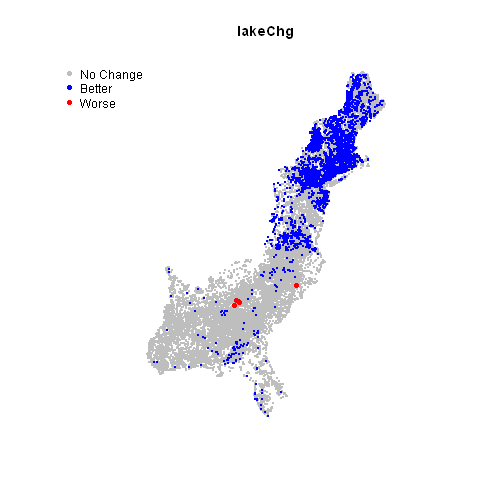

East Coast SPARROW: Lake Trophic State Change Analysis for the CMAQ Scenario
========================================================
Stuff to do 
-------------------------
* missing flow (TOT_CFS) data for MRB2

<!---
use these command instead of the knit icon if you want the data and work loaded into the R workspace
First make sure you are in the analysis directory: 
  setwd('analysis')
  library(knitr)
  knit('trophicStateCMAQ.rmd')
  
Some useful RSQLite commands
      EC<-dbConnect(SQLite(), dbname='../data/EClakes.sqlite')
      dbListTables(EC)                         # List the tables in the database
      dbListFields(EC, "R2002m1")               # List the columns in a table
      dbReadTable(EC, "R2002m2")                # Display the data in a table method1
      dbGetQuery(EC, "SELECT * from R2020m1")   # Display the data in a table method2
-->
Introduction
-------------------------
* The East Coast SPARROW model predicts nitrogen loads to streams in MRB1 and MRB2 (HUC regions 01, 02, 03, and 06)
* Information on the East Coast Model can be found here:
  * Moorman, M.C., Hoos, A.B., Bricker, S.B., Moore, R.B., García, A.M., and Ator, S.W., 2014, Nutrient load summaries for major lakes and estuaries of the Eastern United States, 2002: U.S. Geological Survey Data Series 820, 94 p.,  http://dx.doi.org/10.3133/ds820.
* Estimates of atmospheric deposition of nitrogen are derived from the CMAQ (Community Multi-scale Air Quality Model) model (http://www.epa.gov/AMD/Research/RIA/cmaq.html)
* The CMAQ model has:
  * Interpolated depostion based on 2002 data
  * Predicted deposition for 2020 following changes to air rules
* Our goal is to evaluate changes in lake trophic state between 2002 and 2020 based on the EC SPARROW model prediction for nitrogen loads to the lakes in MRB1 and MRB2

Objectives
-------------------------
* Estimate trophic state of lakes based on 2002 conditions
* Estimate trophic state of lakes based on 2020 conditions
* Analyze changes in trophic state between 2002 and 2020
* Map changes in trophic state

Data Sources
-------------------------
* The 2002 and 2020 sparrow N predictions aggregated to lakes for MRB1 and MRB2 are in: '/data/EClakes.sqlite'. 
* Data Definitions: https://github.com/willbmisled/ECsparrow/blob/master/data/EClakesSQL.md
* Includes the following tables:
  * **R2002m1**: N predictions based on 2002 conditions for lakes in MRB1
  * **R2020m1**: N predictions based on 2020 conditions for lakes in MRB1
  * **R2002m2**: N predictions based on 2002 conditions for lakes in MRB2
  * **R2020m2**: N predictions based on 2020 conditions for lakes in MRB2
* Polygon (lakes) and point (lakesPt) locations of the lakes are available in '/data/lakesSpatialData.rda'.  
* Data Definitions: https://github.com/willbmisled/ECsparrow/blob/master/data/lakesSpatialData.md


Results
-------------------------
* Lake trophic state was estimated  based on the inflow, outflow, and in-lake Nitrogen Concentrations for base conditions (2002) and the changes expected by 2020 under the CMAQ scenario.
* Trophic state for inflow and in-lake concentrations were calculated by the USGS for all lakes in MRB1 and MRB2
* Trophic state for outflow concentrations were done here for MRB1 but not MRB2 as we don't have the flow data (TOT_CFS) for MRB2 lakes (yet).
* Below is a table showing the number of lakes by trophic state and the number expected change based on the 2020 CMAQ Scenario


```
##   Year estimate Oligo  Meso    Eu Hyper Missing Improved worse
## 1 2002      out  6084  5542  3690  2569   23681       NA    NA
## 2 2020      out  7719  4721  3161  2284   23681     2734     0
## 3 2002       in  5087 11497 11832 13150       0       NA    NA
## 4 2020       in  7984 10739 10941 11902       0     6286     2
## 5 2002     lake  2764  6154  5957 26691       0       NA    NA
## 6 2020     lake  4830  5770  5649 25317       0     5122     0
```


* Changes are seen all along the east coast.
* Below are maps for the change analysis based on:
  * outChg: outflow concentrations
  * inChg: inflow concentrations
  * lakeChg: in-lake concentrations.

 


 


 


  
