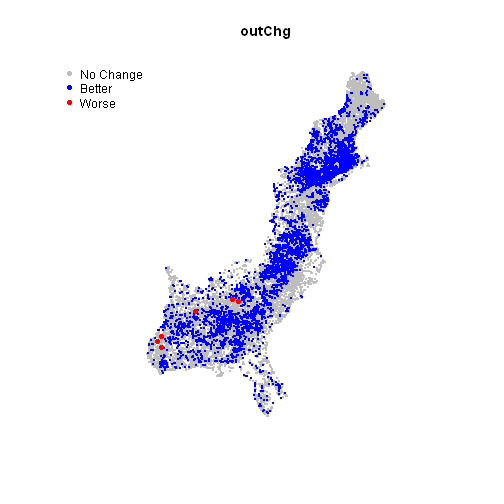
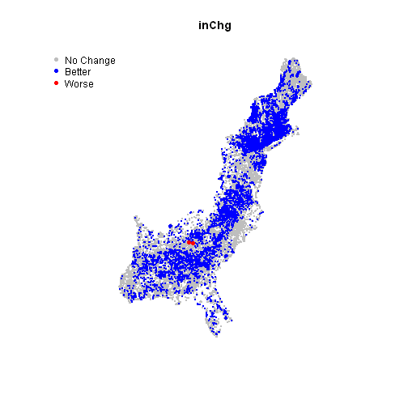

East Coast SPARROW: Lake Trophic State Change Analysis for the CMAQ Scenario
========================================================
Stuff to do 
-------------------------
* ready to go 20141009


<!---
use these command instead of the knit icon if you want the data and work loaded into the R workspace
First make sure you are in the analysis directory: 
  getwd()
  setwd('..')
  setwd('analysis')
  library(knitr)
  knit('trophicStateCMAQ.rmd')
  
Some useful RSQLite commands
      EC<-dbConnect(SQLite(), dbname='../data/EClakes.sqlite')
      dbListTables(EC)                         # List the tables in the database
      dbListFields(EC, "R2002m2")               # List the columns in a table
      dbReadTable(EC, "R2002m2")                # Display the data in a table method1
      dbGetQuery(EC, "SELECT * from R2020m1")   # Display the data in a table method2
-->

Introduction
-------------------------
* The East Coast SPARROW model predicts nitrogen loads to streams in MRB1 and MRB2 (HUC regions 01, 02, 03, and 06)
* Information on the East Coast Model can be found here:
  * Moorman, M.C., Hoos, A.B., Bricker, S.B., Moore, R.B., García, A.M., and Ator, S.W., 2014, Nutrient load summaries for major lakes and estuaries of the Eastern United States, 2002: U.S. Geological Survey Data Series 820, 94 p.,  http://dx.doi.org/10.3133/ds820.
* Estimates of atmospheric deposition of nitrogen are derived from the CMAQ (Community Multi-scale Air Quality Model) model (http://www.epa.gov/AMD/Research/RIA/cmaq.html)
* The CMAQ model has:
  * Interpolated N deposition based on 2002 data
  * Predicted N deposition for 2020 following changes to air rules
* Our goal is to evaluate changes in lake trophic state between 2002 and 2020 based on the EC SPARROW model prediction for nitrogen loads to the lakes in MRB1 and MRB2
* Link to this document: https://github.com/willbmisled/ECsparrow/blob/master/analysis/trophicStateCMAQ.md

Objectives
-------------------------
* Estimate trophic state of lakes based on 2002 conditions
* Estimate trophic state of lakes based on 2020 conditions
* Analyze changes in trophic state between 2002 and 2020
* Map changes in trophic state

Data Sources
-------------------------
* The 2002 and 2020 sparrow N predictions aggregated to lakes for MRB1 and MRB2 are in: '/data/EClakes.sqlite'. 
* Data Definitions: https://github.com/willbmisled/ECsparrow/blob/master/data/EClakesSQL.md
* Includes the following tables:
  * **R2002m1**: N predictions based on 2002 conditions for lakes in MRB1
  * **R2020m1**: N predictions based on 2020 conditions for lakes in MRB1
  * **R2002m2**: N predictions based on 2002 conditions for lakes in MRB2
  * **R2020m2**: N predictions based on 2020 conditions for lakes in MRB2
* Polygon (lakes) and point (lakesPt) locations of the lakes are available in '/data/lakesSpatialData.rda'.  
* ECstates boundaries are available in '/data/ECstates.rda'.  
* Data Definitions for spatial data: https://github.com/willbmisled/ECsparrow/blob/master/data/lakesSpatialData.md


Add States to Lakes TSN table
-------------------------
* To assess changes by state we add a field for state name to TSN
* Anne Hoos assigned the MRB2 lakes to states
* Lakes also assigned to states in lakesSpatialData.Rmd (df "lakeStates" in lakesSpatialData.rda)
* State assignments compared and 34 were different
* The differences appear to be on state borders so are due to slight differences in line work
* Several were viewed in ArcGIS confirming they were on the state borders.
* Below is a list of non-matches


```
##            WBRCHCODE ST_Anne ST
## 277   03010102002859      NC VA
## 1637  03010204002178      NC VA
## 1647  03010204002202      NC VA
## 1659  03010204002216      NC VA
## 1696  03010205008509      NC VA
## 1698  03010205008518      NC VA
## 5816  03040202002094      NC SC
## 6859  03050105002274      NC SC
## 8744  03060102001142      SC GA
## 8745  03060102001143      SC GA
## 8924  03060104001819      SC GA
## 9255  03060106002959      GA SC
## 9394  03060106003208      GA SC
## 9665  03060109001039      GA SC
## 13059 03070204000848      GA FL
## 16330 03130003004964      AL GA
## 16408 03130004001566      AL GA
## 16415 03130004001749      FL GA
## 17614 03140103002175      AL FL
## 17799 03140106000757      FL AL
## 17819 03140106000812      AL FL
## 17833 03140107000208      AL FL
## 18024 03140202002803      FL AL
## 18666 03150105002235      AL GA
## 18717 03150105002361      AL GA
## 21325 03160201002840      AL MS
## 22575 03180004004006      MS LA
## 22613 03180004004133      LA MS
## 22618 03180004004154      LA MS
## 22621 03180004004167      LA MS
## 22630 03180004004211      LA MS
## 23066 06020002002519      NC GA
## 23127 06030002003503      AL TN
## 23334 06030005002659      TN AL
```


Results
-------------------------
* Lake trophic state was estimated  based on the inflow, outflow, and in-lake Nitrogen Concentrations for base conditions (2002) and the changes expected by 2020 under the CMAQ scenario.
* Trophic state for inflow and in-lake concentrations were calculated by the USGS for all lakes in MRB1 and MRB2
* Trophic state for outflow concentrations were done here for MRB1 but not MRB2 as we don't have the flow data (TOT_CFS) for MRB2 lakes (yet).
* Below is a table showing the number of lakes by trophic state and the number expected change based on the 2020 CMAQ Scenario


```
##   Year Estimate Oligo  Meso    Eu Hyper Missing Improved Worse
## 1 2002      out  9813 13587 11694  6472       0       NA    NA
## 2 2020      out 12432 12775 10560  5799       0     5105     6
## 3 2002       in  5087 11497 11832 13150       0       NA    NA
## 4 2020       in  7984 10739 10941 11902       0     6286     2
## 5 2002     lake 24663  7258  4741  4904       0       NA    NA
## 6 2020     lake 26758  6559  3936  4313       0     4087     5
```


* Changes are seen all along the east coast.
* Below are maps for the change analysis based on:
  * outChg: outflow concentrations
  * inChg: inflow concentrations
  * lakeChg: in-lake concentrations.

 


 


 


Changes By State
-------------------------
* Below is a table that shows the changes by state
* N is the number of lakes in the state (lakes that occur in more than 1 state arbitrarily assigned)
* Better = number of lakes that improved by 1 trophic state (e.g., moved from Mesotrophic to Oligotrophic)
* NoChange = number of lakes that did not change trophic state
* Worse = number of lakes that got worse by 1 trophic state (e.g., moved from Oligotrophic to Mesotrophic)


```
##    ST    N Better NoChange Worse BetterPercent WorsePercent
## 1  AL 3425    341     3083     1          9.96         0.03
## 2  CT 1458    278     1180     0         19.07         0.00
## 3  DC    1      0        1     0          0.00         0.00
## 4  DE  187      1      186     0          0.53         0.00
## 5  FL 1426    126     1300     0          8.84         0.00
## 6  GA 7550    691     6857     2          9.15         0.03
## 7  KY   28      1       27     0          3.57         0.00
## 8  LA   75      1       74     0          1.33         0.00
## 9  MA 1867    368     1499     0         19.71         0.00
## 10 MD  603     33      570     0          5.47         0.00
## 11 ME 3126    152     2974     0          4.86         0.00
## 12 MS 1416    120     1293     3          8.47         0.21
## 13 NC 4800    506     4294     0         10.54         0.00
## 14 NH 1157    162      995     0         14.00         0.00
## 15 NJ 1432    220     1212     0         15.36         0.00
## 16 NY 2958    602     2356     0         20.35         0.00
## 17 PA 2009    408     1601     0         20.31         0.00
## 18 RI  368     54      314     0         14.67         0.00
## 19 SC 3225    330     2895     0         10.23         0.00
## 20 TN  393     50      343     0         12.72         0.00
## 21 VA 3446    514     2932     0         14.92         0.00
## 22 VT  486    115      371     0         23.66         0.00
## 23 WV   87     26       61     0         29.89         0.00
```

